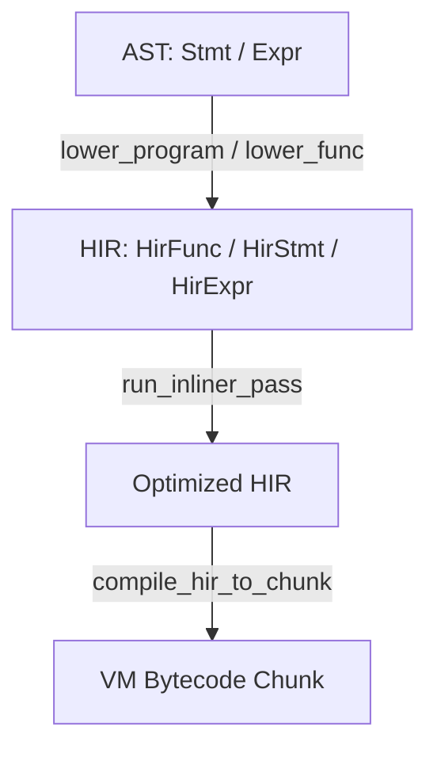

# High-Level Intermediate Representation (HIR) Subsystem (`src/hir/`)

The HIR subsystem bridges the AST (produced by the frontend parser) and the virtual machine's output bytecode. It acts as an optimization and normalization layer, supporting compile-time inlining and pre-verified register mappings.

## Subsystem Pipeline

## Directory Index

- **[hir_core.md](hir_core.md):** Core HIR data structures (`HirFunc`, `HirStmt`, `HirExpr`), local variable representation (`HirLocal`), and typed representations.
- **[hir_lower.md](hir_lower.md):** Lowering logic mapping AST constructs to HIR (`lower.rs`, `lower_expr.rs`, `lower_stmt.rs`) and type resolution.
- **[hir_inline.md](hir_inline.md):** The iterative inlining pass (`pass.rs`, `inline.rs`) and the heuristics/safety check conditions (`inline_policy.rs`).
- **[hir_codegen.md](hir_codegen.md):** Code generation converting HIR to target bytecode (`compile_hir.rs`, `compile_expr.rs`), including special compiler-intrinsic calls and SQLite query optimizations (`compile_expr_special.rs`).
